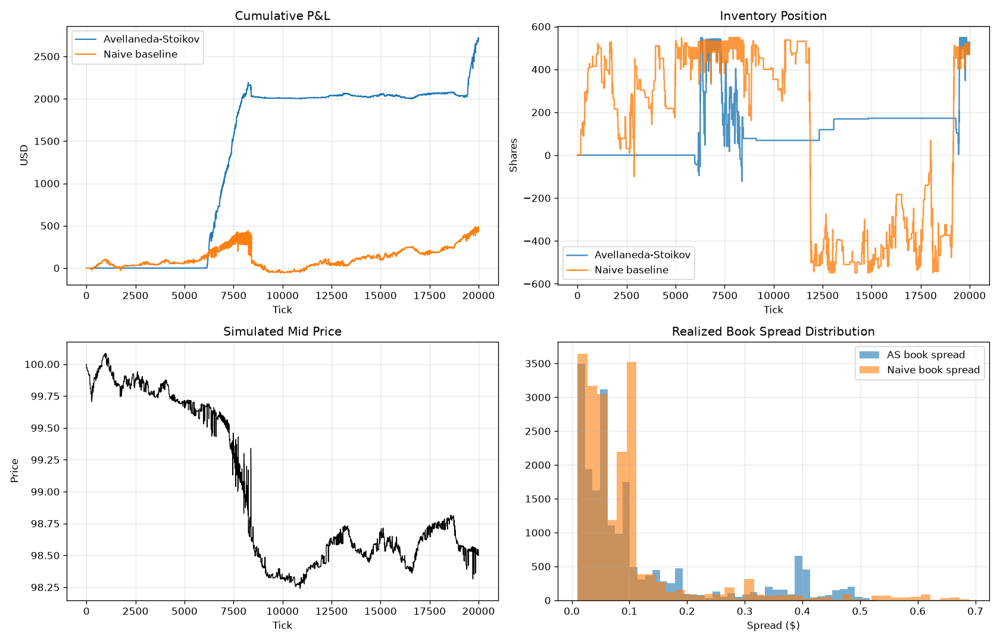

# High-Frequency Market Making Simulation

A limit order book with a **real price-time-priority matching engine**, an
**Avellaneda-Stoikov optimal market maker**, and a naive fixed-spread baseline,
backtested on identical synthetic order flow so the two strategies can be
compared head-to-head — not just simulated, but with a quantified, reproducible
answer to "does the optimal-control logic actually help?"

## Overview

A market maker continuously quotes both a bid and an ask, earning the spread from
uninformed order flow while managing the risk of holding a directional position
(inventory) as prices move. This project implements:

- A **limit order book** (`src/hft_mm/order_book.py`) with heap-based price-time
  priority and a real matching engine — incoming orders actually cross and trade
  against resting liquidity, with lazy deletion so cancelled orders can never be
  reported as the best bid/ask.
- A **synthetic market environment** (`src/hft_mm/simulator.py`): a Brownian-motion
  fundamental price plus Poisson-arrival noise-trader order flow, reproducible
  from a seed, with no external data dependency.
- **Feature engineering** (`src/hft_mm/features.py`): real size-weighted
  microprice and order-book-depth imbalance, realized volatility across multiple
  windows, momentum, and spread features.
- An **Avellaneda-Stoikov market maker** (`src/hft_mm/market_maker.py`) with the
  correctly-derived reservation price and optimal spread formulas, and a **naive
  fixed-spread baseline** for comparison.
- A **backtester** (`src/hft_mm/backtester.py`) with correct mark-to-market P&L
  accounting from real matching-engine trades, and a **metrics** module
  (`src/hft_mm/metrics.py`) covering Sharpe/Sortino, max drawdown, fill rate,
  adverse selection, and inventory risk.

## Architecture

```
src/hft_mm/
├── order_book.py     # Order, Side, Trade, LimitOrderBook (matching engine)
├── simulator.py       # MarketEnvironment: Brownian mid-price + Poisson order flow
├── features.py         # MarketDataProcessor: microprice, imbalance, vol, momentum
├── market_maker.py    # AvellanedaStoikovMarketMaker, NaiveMarketMaker
├── backtester.py       # Backtester: ties environment + LOB + strategy together
└── metrics.py           # Sharpe, Sortino, max drawdown, fill rate, adverse selection
```

## Methodology

**Matching engine.** Bids sit in a max-heap (price negated), asks in a min-heap;
equal prices break ties on timestamp, giving price-time priority. An incoming
order matches against the opposite side while price crosses — trading at the
resting (maker's) price — before any unfilled remainder rests on the book.
Cancelled orders are removed from the live-order dict immediately but left in the
heap; every heap read skips and permanently pops any entry whose order is no
longer live, so a cancelled order can never be matched against or reported as the
best bid/ask.

**Market environment.** The fundamental mid price follows `dS = sigma * dW` — the
same assumption used in the original Avellaneda-Stoikov paper's own validation.
Each tick, a noise trader may post a resting limit order near the fundamental
(giving the book real depth) and/or submit a market order that crosses the book.
Market orders are what actually generate fills — including fills against a market
maker's own resting quotes — through the real matching engine, rather than a fixed
coin-flip fill probability disconnected from the state of the book.

**Avellaneda-Stoikov market maker.** From Avellaneda & Stoikov (2008),
*"High-frequency trading in a limit order book"*:

```
reservation price:  r(t) = s - q · γ · σ² · (T - t)
optimal spread:      δ = γ · σ² · (T - t) + (2 / γ) · ln(1 + γ / k)
```

`q` is current inventory, `σ` the per-tick volatility of the mid price (estimated
online from realized returns and de-annualized back to per-tick units before use
— a unit mismatch here is a classic way to silently break this model), `γ` risk
aversion, `k` the calibrated decay of fill probability with distance from mid, and
`T - t` ticks remaining in the session. Both the inventory skew and the
risk-aversion component of the spread shrink to zero as the session's close
approaches, so the strategy mechanically flattens into a symmetric mid-quoter
right at `T`.

**Naive baseline.** A fixed symmetric spread around the mid price — no inventory
skew, no volatility adjustment. Run on the *same* seed and order flow as the AS
strategy, this isolates how much the optimal-control logic actually adds.

**P&L accounting.** `cash` moves on every fill from a real `Trade` object (buy:
`cash -= price·qty·(1+fee)`; sell: `cash += price·qty·(1-fee)`), with the fill side
determined unambiguously from whether the strategy's own order was the resting
maker or the crossing taker. Total P&L at any tick is `cash + inventory · mid_price`
(mark-to-market).

## Results

20,000-tick backtest, seed 7, identical order flow for both strategies
(`python run_demo.py` or `notebooks/simulation_demo.ipynb`):

| Metric | Avellaneda-Stoikov | Naive Baseline |
|---|---:|---:|
| Total P&L ($) | **2,706.61** | 432.70 |
| Sharpe Ratio | **94.83** | 4.32 |
| Sortino Ratio | **32.79** | 1.73 |
| Max Drawdown ($) | **195.12** | 501.53 |
| Avg \|Inventory\| | **122.1** | 404.9 |
| Max \|Inventory\| | 548.0 | 549.0 |
| Fill Rate | 1.2% | 4.2% |
| Avg Spread ($) | 0.1148 | 0.0942 |

The Avellaneda-Stoikov strategy captures roughly **6x the P&L** at **~1/3 the
average inventory risk** of the naive baseline, with a far higher risk-adjusted
return (Sharpe 94.8 vs. 4.3) and less than half the max drawdown — the inventory
skew mechanism visibly holds the position closer to flat for long stretches,
whereas the naive quoter (which never adjusts for inventory) swings across its
full position-cap range repeatedly. Results are consistent in direction across
five independent seeds (1, 7, 42, 99, 123): AS beat naive on P&L, Sharpe, and
average inventory in every run.



*Top-left: cumulative P&L. Top-right: inventory over time — note the naive
baseline's much wider swings. Bottom-left: the simulated fundamental price path.
Bottom-right: realized book spread distribution.*

See `notebooks/simulation_demo.ipynb` for the full executed run with inline
output, or `run_demo.py` for the same comparison as a script.

### 🎥 Simulation replay

[`results/simulation_demo.mp4`](results/simulation_demo.mp4) is an animated,
tick-by-tick replay of the exact backtest above — the mid price, inventory, and
cumulative P&L for both strategies building up live, on the same seeded run.
Regenerate it with `python make_demo_video.py`.

## How to run

```bash
python -m venv .venv
source .venv/bin/activate  # Windows: .venv\Scripts\activate
pip install -r requirements.txt

python run_demo.py              # CLI: runs both strategies, prints the table, saves the plot
python make_demo_video.py       # renders results/simulation_demo.mp4 (requires ffmpeg)
jupyter notebook notebooks/simulation_demo.ipynb   # same comparison, notebook form
pytest                          # run the test suite
```

## Testing

```bash
pytest -v
```

31 tests across four files, targeting the specific things that were broken in an
earlier version of this project: `test_order_book.py` validates real matching
(crossing, partial fills, price-time priority) and that cancellation actually
removes liquidity; `test_features.py` validates microprice and imbalance against
hand-computed expected values; `test_market_maker.py` validates that reservation
price moves the correct direction with inventory, that spread responds correctly
to volatility and time-to-close, and that quotes never go negative or cross even
under extreme parameters; `test_backtester.py` independently replays the fills log
against the backtester's own cash/inventory state to confirm the P&L accounting
is internally consistent, plus a determinism check.

## Assumptions & Limitations

This is a research/demo project, not a production trading system. Notable
simplifications:

- **Synthetic order flow only.** The noise-trader flow is uninformed by
  construction (random side, independent of the fundamental's future direction).
  Real markets have informed/toxic flow that specifically targets stale quotes;
  the "adverse selection" metric here mostly reflects sampling noise rather than a
  true adverse-selection effect, since there's no informed counterparty to model it against.
- **Constant-parameter calibration.** `γ` (risk aversion) and `k` (fill-intensity
  decay) are fixed inputs, as in the original AS paper — a live system would
  re-estimate `k` from observed fill rates and adapt `γ` to risk limits.
- **Price-time priority only.** No modeling of queue position beyond what the
  matching engine already captures, no latency/co-location effects, and no
  multi-venue considerations.
- **Sharpe ratios reported here are large** (order 5-100) because the
  annualization factor assumes 1 tick ≈ 1 second and the backtest window is short
  (20,000 ticks ≈ 5.5 trading hours); short-horizon HFT backtests routinely
  produce statistically extreme-looking Sharpe ratios once annualized this
  aggressively. Treat these as *relative* comparisons between strategies on
  identical order flow, not as a realistic expectation for live annualized
  performance.
- **A real calibration finding worth keeping**: the fundamental's per-tick
  volatility must stay meaningfully smaller than the typical quoted spread. An
  earlier calibration (`sigma=0.05`, quoted spreads ~0.10–0.40) had the
  fundamental moving through quoted price levels almost every tick, so *every*
  strategy — including the naive baseline — lost money badly regardless of
  quoting logic; there was no regime in which resting orders could capture edge
  from the flow. The current default (`sigma=0.01`) is calibrated so market
  making actually has an edge to earn, which is itself the more realistic regime
  for how real order books behave (per-tick fundamental moves are usually small
  relative to the quoted spread).
